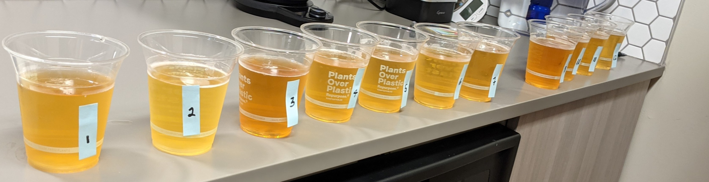

# Beer tasting data science and algroithm

While bubbled together during the pandemic,  a group of friends and I started doing blind taste tests for fun and to determine if we actually had "refined" taste or if we were just pretentious.

We eventually decided to do this with more standard lighter beer to determine if we could tell the difference and if our snobby attitude toward lighter beer was valid. The choices were the following, not particularly in any order:
* Rolling Rock
* Montucky Cold Snacks
* Miller High Life
* Rainier
* Kokanee
* PBR
* Coors Banquet
* Hamm's
* Modelo
* 10 Barrel Pub Beer (our craft control)
* Tecate
* Budweiser

## Setup
We did the test as a double blind so that no person would know which beer they were drinking. 

We quickly realized that the tastes of the beers were blending together since there were so many, so I came up with a rating strategy that ended up looking pretty algorithmic.

### Beer ranking algorithm
1. Taste the first beer and then the second beer and rank them relative to each other.
2. Taste the third beer and rank it relative to the first and second beer.
3. For the rest of the beers, taste the current beer and compare it to the middle ranked beer(s) of the beers that you have already ranked.
    * If it tastes better, designate all beers currently ranked higher than the middle beer as your new comparison group. 
    * If worse, designate all beers currently ranked lower than the middle beer as the new comparison group. 
    * Repeat step 3 until the beer has been ranked.
4. Repeat this process for all beers, making comparisons as necessary until you have established a ranking for each beer.

## Results

| Name | Average Ranking|
| ----- | ----- |
|Kokanee                              |  6.2|
|10 Barrel Pub Beer (craft control)   |  5.4|
|Rolling Rock                         |  5.8|
|Coors Banquet                        |  6.6|
|PBR                                  |  6.6|
|Rainier                              |  7.6|
|Tecate                               |  7.8|
|Modelo                               |  6.6|
|Budweiser                            | 11.0|
|Miller High Life                     |  6.2|
|Montucky Cold Snacks                 |  2.4|
|Hamm's                               |  5.8|

The standard deviation shows our agreement among beer ranking. It appears that all five of us agreed that Montucky Cold Snacks was by far the best tasting, PBR is a decent middle of the pack beer, and that we all absolutely disliked budweiser. Anything else can just be considered preferential.
## What we would change
The beers got warm pretty quickly, so either cooling them somehow or having a cold version anonymized and ready would be important.

This taste test is exactly that a *taste* test. Because of that, one friend and I found we had a preference for Miller High Life while doing small tastes during the test, but did not enjoy drinking a whole beer.
